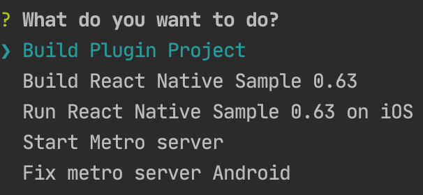

## Ver-ID React Native

## Introduction

The following instructions to run a sample will work for each of the
samples provided.

## Steps to run a React Native sample

1. Clone the **samples** branch of the plugin Git repo into your file system:

    ```
    git clone -b samples https://github.com/AppliedRecognition/Ver-ID-React-Native.git
    ```
1. To set up your environment with the basic configuration needed by react native please follow [react native guide](https://reactnative.dev/docs/environment-setup).

1. Please make sure you have installed [Yarn](https://classic.yarnpkg.com/en/docs/install/),
you can check if it is installed by running the following command.

	```
	yarn -v
	```
1. To run the iOS project, make sure to install **XCODE 11.5** or **Android Studio 3.5.3** for Android project.
    - If you need to download this version of Android Studio,
    you can do it from this page: [Android Studio 3.5.3](https://developer.android.com/studio/archive)

1. Go to the directory of the cloned plugin, this can be done by using the following command:

    ```
    cd Ver-ID-React-Native/
    ```

1. Run the following command to install all the dependencies:

    ```
    yarn
    ```
1. Run this command to open a menu that will help to build and run the samples:

    ```
    yarn build
    ```
   A command line menu will show, and looks like this:

   

1. Please select the sample version you want to build.

1. After that you can open the platform project you want using Xcode or Android Studio,
the locations are:
    - Android
        ```
            plugin_directory/samples/reactNativeSample[React Native Version]/android
        ```
    - iOS
        ```
            plugin_directory/samples/reactNativeSample[React Native Version]/ios
        ```
## CLI Options
TODO

## Issues

TODO
